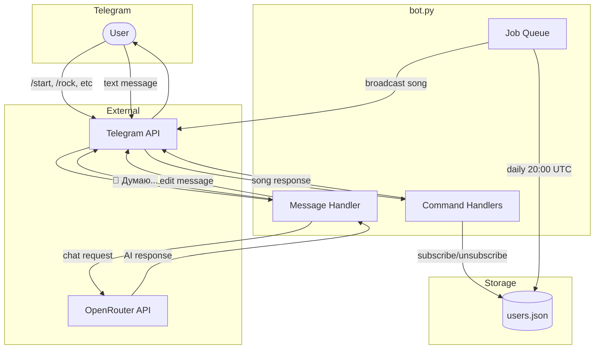
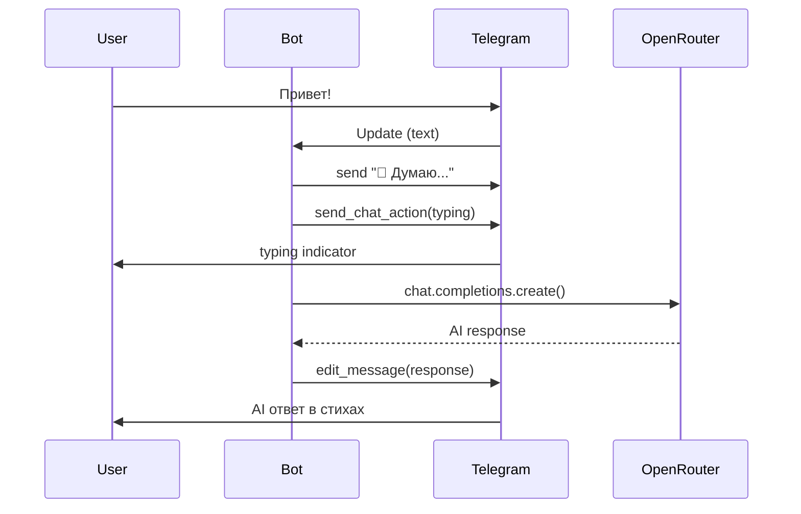

# Telegram Music Bot

Телеграм-бот с подборкой песен и AI-чатом.

## Возможности

- Песни по жанрам (rock, pop, jazz, electronic, classical)
- Ежедневная рассылка "Песня дня" в 20:00 UTC
- AI-чат через OpenRouter (любая модель: DeepSeek, Claude, GPT, Gemini)

## Архитектура



## AI Chat Flow



## Команды

| Команда | Описание |
|---------|----------|
| `/start` | Подписка на ежедневные песни |
| `/stop` | Отписка |
| `/rock` | Рок-песня |
| `/pop` | Поп-музыка |
| `/jazz` | Джаз |
| `/electronic` | Электроника |
| `/classical` | Классика |
| `/random` | Случайная песня |
| `/test` | Тестовая рассылка |

Любое текстовое сообщение (не команда) — отправляется AI.

## Установка

```bash
# 1. Клонировать
git clone https://github.com/serejaris/telegram-news-scraper.git
cd telegram-news-scraper

# 2. Виртуальное окружение
python -m venv .venv
source .venv/bin/activate

# 3. Зависимости
pip install -r requirements.txt

# 4. Конфигурация
cp .env.example .env
# Заполнить BOT_TOKEN и OPENROUTER_API_KEY

# 5. Запуск
python bot.py
```

## Конфигурация (.env)

```bash
BOT_TOKEN=...                              # Telegram bot token
OPENROUTER_API_KEY=...                     # OpenRouter API key
AI_MODEL=deepseek/deepseek-r1-0528:free    # Модель (опционально)
AI_SYSTEM_PROMPT=Ты помощник...            # Системный промпт (опционально)
```

Доступные модели: `google/gemini-2.0-flash-exp:free`, `deepseek/deepseek-chat`, `anthropic/claude-3.5-sonnet`, `meta-llama/llama-3.3-70b-instruct:free`

## Деплой

Бот должен работать постоянно для ежедневных рассылок:
- [Railway](https://railway.app)
- [Heroku](https://heroku.com)
- VPS
