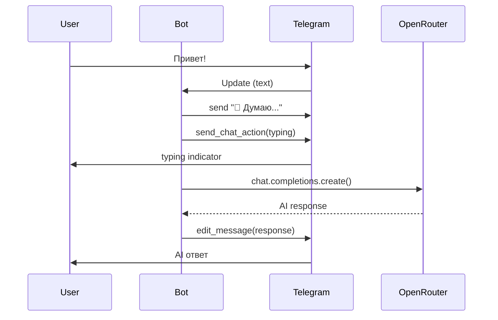

# Telegram AI Chat Bot

Телеграм-бот с AI-чатом через OpenRouter.

## Возможности

- AI-чат через OpenRouter (любая модель: DeepSeek, Claude, GPT, Gemini)
- Настраиваемый системный промпт
- "Думаю..." индикатор во время обработки

## Архитектура

```mermaid
flowchart TB
    subgraph Telegram
        User([User])
    end

    subgraph Bot["bot.py"]
        CMD[/start handler]
        MSG[Message Handler]
    end

    subgraph External
        TG_API[Telegram API]
        OR_API[OpenRouter API]
    end

    User -->|/start| TG_API
    User -->|text message| TG_API
    TG_API --> CMD
    TG_API --> MSG

    CMD -->|welcome| TG_API

    MSG -->|"🤔 Думаю..."| TG_API
    MSG -->|chat request| OR_API
    OR_API -->|AI response| MSG
    MSG -->|edit message| TG_API

    TG_API --> User
```

## AI Chat Flow



## Установка

```bash
# 1. Клонировать
git clone https://github.com/serejaris/telegram-news-scraper.git
cd telegram-news-scraper

# 2. Виртуальное окружение
python -m venv .venv
source .venv/bin/activate

# 3. Зависимости
pip install -r requirements.txt

# 4. Конфигурация
cp .env.example .env
# Заполнить BOT_TOKEN и OPENROUTER_API_KEY

# 5. Запуск
python bot.py
```

## Конфигурация (.env)

```bash
BOT_TOKEN=...                              # Telegram bot token
OPENROUTER_API_KEY=...                     # OpenRouter API key
AI_MODEL=deepseek/deepseek-r1-0528:free    # Модель (опционально)
AI_SYSTEM_PROMPT=Ты помощник...            # Системный промпт (опционально)
```

Доступные модели: `google/gemini-2.0-flash-exp:free`, `deepseek/deepseek-chat`, `anthropic/claude-3.5-sonnet`, `meta-llama/llama-3.3-70b-instruct:free`
